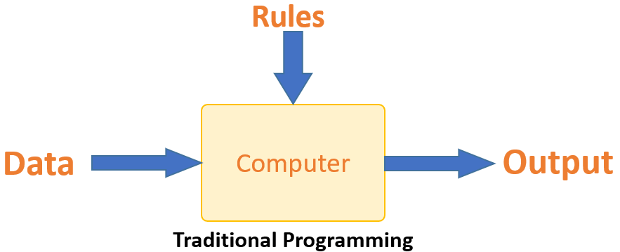
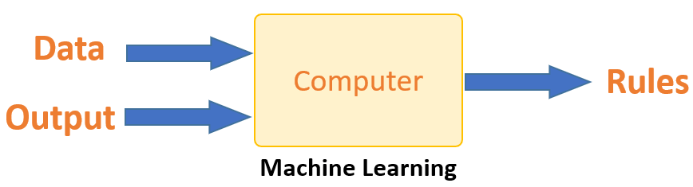

# Model and Cost Function 

So from the intro you might be under be understanting why traditional programming lacks capability to process data and it is overcomed by machine learning.  

###### <i>But How does Machine Learning works better than Traditional Programs ? </i>

### Traditional Programing

Traditional programming differs significantly from machine learning. In traditional programming, a programmer code all the rules in consultation with an expert in the industry for which software is being developed. Each rule is based on a logical foundation; the machine will execute an output following the logical statement. When the system grows complex, more rules need to be written. It can quickly become unsustainable to maintain.

> ##### Example   
> Suppose you are said to write program for Multiplying a number by 3 and Add 7 to it ... So your Program will be  
>y = 3 * x + 7  
> For Given Input Of x = { 1,2,3,4,5...} we will get Output as y = {10,13,16,19,22...} 
> So Relation between x and y will be y = 3x + 7 
> But if I said Find Relation between x = {1,2,3...} and y = {5,10,15....} <strong> You Have To write entire new program :cold_sweat: </strong> 

### Machine Learning Approch
Machine learning is supposed to overcome this issue. The machine learns how the input and output data are correlated and it writes a rule. The programmers do not need to write new rules each time there is new data. The algorithms adapt in response to new data and experiences to improve efficacy over time.

> ##### For the Same Above Example  
> In Machine Learning Programs you Just have to send x = {1,2,3...} and   y = {10,13,16,...} or for x={1,2,3,...} and y = {5,10,15,...} 
> So For Various Inputs you have to write <strong>One program</strong> and Rules for each set of inputs and outputs are given to us by Computer  
> Smart Right ? :laughing:

  This Output of <strong>Rules</strong> is stored in a Black Box known as <Strong>Model</strong> 

 ### Model
 In simple words 
 >##### <i> " A Machine Learning Model is an Mathematical Representation of Various Processes that are done on the Input Data to get the Desired Output Data/Predictions"</i>

 The model is <strong>trained</strong> by feeding it data as Input and Output. 
The Greater the Data, Greater will be the Model be able to Adapt to the Correlations between the data
 
 ###### <i>But Howcome we will know if the Model has Adapted to our Inputs and Outputs well ?</i>

 ### Cost Function 
  In ML, the focus is on learning from data. This is perhaps better illustrated using a simple analogy. As children we typically learn what is “right” or “good” behaviour by being told NOT to do things or being punished for having done something we shouldn’t.  
  > For example  
  > Imagine a child sitting by a fire to keep warm, but not knowing the danger, she puts her finger into it and gets burned. The next time she sits by the fire, she doesn’t get burned, but she sits too close, gets too hot and has to move away. The third time she sits by the fire she finds the distance that keeps her warm without exposing her to any danger.  In other words, through experience and feedback the kid learns the optimal distance to sit from the fire. The heat from the fire in this example acts as acost function — <strong> it helps the learner to correct / change behaviour to minimize mistakes.</strong> 

Simply put , a cost function is a measure of how wrong the model is in terms of its ability to estimate the relationship between X and y. This is typically expressed as a difference or distance between the predicted value and the actual value. The cost function (you may also see this referred to as loss or error.) can be estimated by iteratively running the model to compare estimated predictions against “ground truth” — the known values of y.