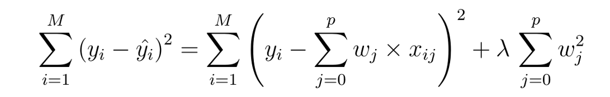
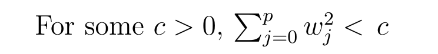
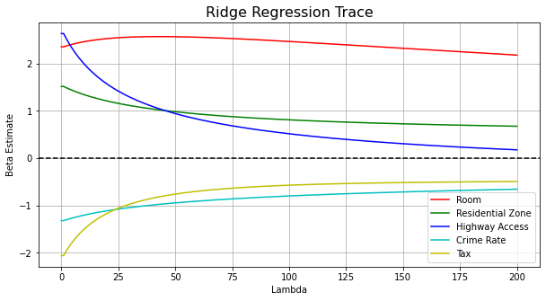

# This is Ridge and Lasso Regression

Before Starting Ridge/Lasso Regression Lets Identify the Drawbacks of Linear Regression

- Linear Regression Is Limited to Linear Relationships
- Linear regression looks at a relationship between the mean of the dependent variable and the independent variables
- Linear Regression Is Sensitive to Outliers
- Data Must Be Independent 


 Ridge and Lasso regression are some of the simple techniques to reduce model complexity and prevent over-fitting which may result from simple linear regression.

- ## Ridge Regression
  
In ridge regression, the cost function is altered by adding a penalty equivalent to square of the magnitude of the coefficients.



This is equivalent to saying minimizing the cost function 




So ridge regression puts constraint on the coefficients (w). The penalty term (lambda) regularizes the coefficients such that if the coefficients take large values the optimization function is penalized. So, ridge regression shrinks the coefficients and it helps to reduce the model complexity and multi-collinearity. 

- ## Lasso Regression
  


So Comparing Ridge And Lasso Regression we get

| Ridge Regression | Lasso Regression | 
|--|--|
 Performs L2 regularization, i.e. adds penalty equivalent to <b>square of the magnitude</b> of coefficients | Performs L1 regularization, i.e. adds penalty equivalent to<b> absolute value of the magnitude</b> of coefficients | 
  | Minimization objective = LS Obj + α * (sum of square of coefficients) |Minimization objective = LS Obj + α * (sum of absolute value of coefficients)  |


```python
# LOADING DATASET

# imports
import numpy as np
import pandas as pd
import matplotlib.pyplot as plt
import matplotlib.ticker as ticker
from sklearn.datasets import load_boston
from sklearn import preprocessing
from sklearn.model_selection import train_test_split
from sklearn.linear_model import LinearRegression, Ridge
from sklearn.metrics import r2_score, mean_squared_error

# Dataset
house_price = load_boston()
df = pd.DataFrame(house_price.data, columns=house_price.feature_names)
df['PRICE'] = house_price.target

# standardize and train/test split

house_price.data = preprocessing.scale(house_price.data)
X_train, X_test, y_train, y_test = train_test_split(
    house_price.data, house_price.target, test_size=0.3, random_state=10)
```

<!-- tabs:start -->

#### ** Ridge **

```python
# initialize
ridge_reg = Ridge(alpha=0)
ridge_reg.fit(X_train, y_train)
ridge_df = pd.DataFrame({'variable': house_price.feature_names, 'estimate': ridge_reg.coef_})
ridge_train_pred = []
ridge_test_pred = []

# iterate lambdas
for alpha in np.arange(0, 200, 1):
    # training
    ridge_reg = Ridge(alpha=alpha)
    ridge_reg.fit(X_train, y_train)
    var_name = 'estimate' + str(alpha)
    ridge_df[var_name] = ridge_reg.coef_
    # prediction
    ridge_train_pred.append(ridge_reg.predict(X_train))
    ridge_test_pred.append(ridge_reg.predict(X_test))

# organize dataframe
ridge_df = ridge_df.set_index('variable').T.rename_axis('estimate').rename_axis(1).reset_index()
```

#### ** Lasso **
```python

dssdf

```

<!-- tabs:end -->




- Ridge Example

[](https://drive.google.com/open?id=1BrAP18eUkhpnIVijFNWP976ZIGSAowwR)