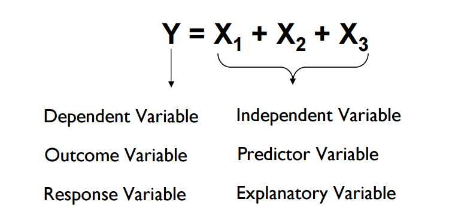

# Linear Regression

Linear Regression is the oldest, simple and widely used supervised machine learning algorithm for predictive analysis. Linear Regression is a method to predict a target variable by fitting the best linear relationship between the dependent and independent variable.




The objective of a linear regression model is to find a relationship between one or more features(independent variables) and a continuous target variable(dependent variable). When there is only feature it is called Uni-variate Linear Regression and if there are multiple features, it is called Multiple Linear Regression.These techniques are used in determining future sales and temperature predictions of a region ,etc.

For Multiple Linear Regression (Multivariate Linear Regression)


- Y is the predicted value
- θ₀ is the bias term.
- θ₁,…,θₙ are the model parameters
- x₁, x₂,…,xₙ are the feature values.

For determining the Bias program keeps on increasing the slope of the line until the optimum line is not achieved


The Accuracy of Fitting the Line is determined by Getting the minimum collection of distances of all points from the line . The [**Least Squares Method**](https://en.wikipedia.org/wiki/Least_squares) is used for determining the Optimum line

Lets Try Implementing the Code For Linear Regression


```python
# GENERATING RANDOM DATA

# imports
import numpy as np
import matplotlib.pyplot as plt

# generate random data-set
np.random.seed(0)
x = np.random.rand(100, 1)
y = 2 + 3 * x + np.random.rand(100, 1)
```

<!-- tabs:start -->

#### ** Keras **

```python 
# Importing Linear Regression Model
from sklearn.linear_model import LinearRegression

# Creating Linear Regression instance
reg = LinearRegression()

# Fitting Line according to input
reg.fit(x, y)

C = reg.intercept_[0]
Slope = reg.coef_[0][0]

# Predicting For Given X
Ypred = reg.predict(X)
```
#### ** Scratch **

```python
#Function to Train and Find Coeddicients 
def LinearRegressionTrain(x, y): 
    # number of observations/points 
    n = np.size(x) 
  
    # mean of x and y vector 
    m_x, m_y = np.mean(x), np.mean(y) 
  
    # calculating cross-deviation and deviation about x 
    SS_xy = np.sum(y*x) - n*m_y*m_x 
    SS_xx = np.sum(x*x) - n*m_x*m_x 
  
    # calculating regression coefficients 
    b_1 = SS_xy / SS_xx 
    b_0 = m_y - b_1*m_x 
    return(b_0, b_1) 

#Function to Predict new Values
def LinearRegressionPredict(xpred,b_0 , b_1):
    return(b_0 * xpred + b_1)

# Main Program

m , c = LinearRegressionTrain( x , y )
Ypred = LinearRegressionPredict( xpred , m , c )

```
<!-- tabs:end -->

<iframe width="800" height="500" frameborder="0" scrolling="no" src="//plot.ly/~naidukarthi2193/4.embed"></iframe>

<br></br>
#### Try the Above Example At Notebook

[](https://drive.google.com/file/d/1Uf751-PO15RxnWhmVez1PXe8O3-vW9UA/view?usp=sharing)