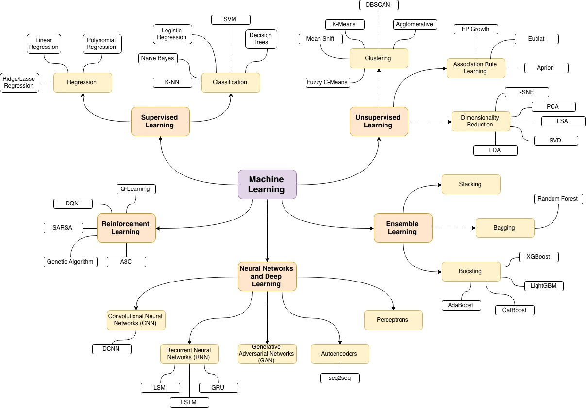

# Machine Learning
Machine Learning (ML) is defined as the use algorithms and computational statistics to learn from data without being explicitly programmed. It is a subsection of the artificial intelligence domain within computer science. Machine learning’s rise to prominence today has been enabled by the abundance of data, more efficient data storage, and faster computers.

>#### <i>" Machine Learning is a field of study that gives computers the ability to learn without being explicitly programmed. "  &nbsp;&nbsp;&nbsp;&nbsp;&nbsp;-by Arthur Samuel</i>

## Different Machine Learning Fields

Depending on what you are trying to accomplish, there are many different ways to get a computer to learn from data. 

## Types of Machine Learning 
- #### [Supervised Learning](Machine_Learning/Supervised_Learning/supervised_learning.md)
- #### [Unsupervised Learning](Machine_Learning/Unsupervised_Learning/unsupervised_learning.md)
- #### [Ensemble Learning](Machine_Learning/Ensemble_Learning/ensemble_learning.md)
- #### [Reinforment Learning](Machine_Learning/Reinforcement_Learning/reinforcement_learning.md)