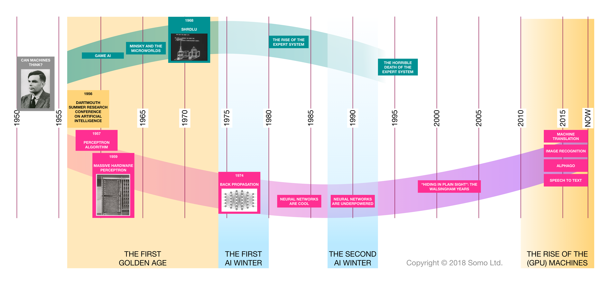

# Machine learning and Deep Learning

This Repo is a collection of Prominent Machine Learning and Deep Learning Concepts with Mathematical Relations and Practical Implementation of the Algorithms in Python. 

### Prerequisite 
- Basic Mathamatical Concepts
- Python Installed Machine
- Calculus
- Google Drive with Colab to Run Python Code

## History and Need  Of Machine Learning
&nbsp;&nbsp;&nbsp;&nbsp;&nbsp;&nbsp; &nbsp;&nbsp;&nbsp;&nbsp;From the Stone Age itself when cavemen started inscriptions on rocks the collection of data was started . After the invention of the First Computer by Alan Turing at 1950's computation of large data was possible. But after the Internet came into existence from 1970's the data storage exploded and the need of Computer Systems to efficiently process data and derive meaning out of it was greatly needed 

&nbsp;&nbsp;&nbsp;&nbsp;&nbsp;&nbsp; &nbsp;&nbsp;&nbsp;&nbsp;
In today's world there are different forms of data Tabular,Images,Sounds, Videos,Binary Files etc. Around <strong>2.5 quintillion bytes</strong> of data is created every day . The pace at which data is created has already surpassed the human and traditional computing programs to process data this gave rise to Developement of Machine Learning and Deep Learning Techniques.

